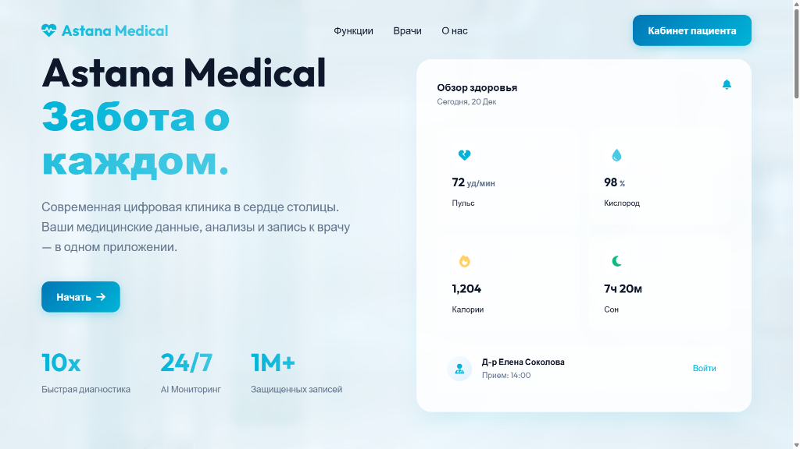

# Astana Medical (MedTrack)



Система управления записями пациентов и личный кабинет для медицинской клиники.

## 📋 О проекте
Данный проект представляет собой веб-приложение для автоматизации работы регистратуры и улучшения взаимодействия с пациентами. Реализован на нативном PHP без использования тяжелых фреймворков для демонстрации понимания базовых принципов MVC и работы с БД.

### Функционал
*   **Авторизация и Регистрация:** Безопасное создание аккаунтов (пароли хэшируются).
*   **Личный кабинет пациента:** Просмотр профиля, статуса записей.
*   **Онлайн-запись:** Выбор врача, даты и времени с сохранением в Базу Данных.
*   **Адаптивный дизайн:** Корректное отображение на мобильных устройствах.
*   **SQLite База Данных:** Простая установка без настройки MySQL сервера.

## 🛠 Технологии
*   **PHP 8+** (Нативный, MVC Архитектура)
*   **SQLite** (Файловая база данных)
*   **HTML5 / CSS3** (Flexbox, Grid, Анимации)
*   **JavaScript** (Минимально для UI)

## 🚀 Как запустить

### Требования
*   Любой веб-сервер с поддержкой PHP (OpenServer, XAMPP, Docker).
*   Расширение `pdo_sqlite` включено в PHP (обычно включено по умолчанию).
*   **Для Docker:** Docker и Docker Compose установлены на вашей системе.

### Установка

#### Вариант 1: Запуск через Docker (Рекомендуется)

1.  Убедитесь, что Docker и Docker Compose установлены:
    ```bash
    docker --version
    docker-compose --version
    ```

2.  Склонируйте репозиторий:
    ```bash
    git clone <repository-url>
    cd MedicalTrackAstana
    ```

3.  Запустите проект с помощью Docker Compose:
    ```bash
    docker-compose up -d
    ```

4.  Откройте браузер и перейдите по адресу:
    ```
    http://localhost:8080
    ```

5.  Для остановки контейнеров:
    ```bash
    docker-compose down
    ```

6.  Для просмотра логов:
    ```bash
    docker-compose logs -f
    ```

**Примечание:** База данных SQLite будет автоматически создана в директории `data/` и сохранится даже после остановки контейнера.

#### Вариант 2: Традиционная установка

1.  Склонируйте репозиторий или распакуйте архив в папку веб-сервера.
2.  Откройте файл `test_db.php` удалите его, если не нужен (был для тестов).
3.  Файл базы данных `database.sqlite` создастся **автоматически** в директории `data/` при первом переходе на сайт или попытке регистрации.

### Структура проекта
*   `app/`
    *   `Controllers/` - Логика обработки запросов.
    *   `Core/` - Роутер и класс Базы Данных.
    *   `Views/` - HTML шаблоны страниц.
*   `public/` - Статические файлы (CSS, картинки).
*   `index.php` - Точка входа в приложение (Front Controller).

## 👤 Автор
Аскар Кемалатдин
